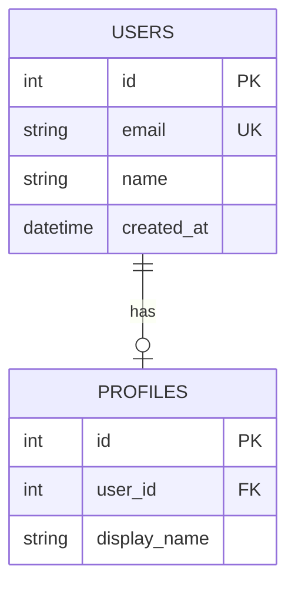

# ERD Generator

Turn an unstructured domain description into a verified Mermaid ER diagram and a rendered SVG.

## Workflow

1. **Check the existing schema first.** Read the migrations in `src/db/migrations/`. Any table that already exists
   (for example `users`) must appear in the diagram with its real columns and types, and must have a comment line
   directly above the entity: `%% existing: USERS (already migrated)`. Never redefine an existing table.
2. **Parse the requirements** into entities, attributes, primary keys (PK), foreign keys (FK), and cardinalities.
   If the request leaves a business rule ambiguous, state the assumption you made in your final answer.
3. **Write the Mermaid syntax** to `docs/architecture/schema.mmd`.
4. **Validate and render** by running this from the repository root:
   `node .agent/skills/erd-generator/scripts/render_erd.js docs/architecture/schema.mmd`
5. **Self-correction loop.** If the output contains `SYNTAX_ERROR`, read the error trace, fix
   `docs/architecture/schema.mmd`, and re-run. Retry at most 3 times. If it still fails, show the last error
   to the user and stop.
6. **Final output.** Present the raw Mermaid block in a ```mermaid code fence, then reference the rendered image at
   `docs/architecture/erd.svg`. List any assumptions made.

## Mermaid syntax rules (most syntax errors come from here)

- Start the file with `erDiagram`.
- Entity names: UPPER_SNAKE_CASE, no spaces.
- Attributes are `type name [PK|FK|UK] ["comment"]`, one per line, inside `{ }`.
- Use simple single-word types: `int`, `string`, `text`, `boolean`, `decimal`, `date`, `datetime`.
  Do not use parentheses in types (write `string`, not `varchar(255)`).
- Foreign key types must match the referenced primary key type (for example, a FK to `USERS.id` is `int`).
- Every relationship needs a label: `PARENT ||--o{ CHILD : "has"`.
- Cardinality symbols: `||` exactly one, `o|` zero or one, `o{` zero or many, `|{` one or many.
  - one-to-many: `||--o{`
  - one-to-one: `||--o|`
- Many-to-many relationships must be modeled with an explicit junction entity (two one-to-many relationships),
  for example BOOK_AUTHORS between BOOKS and AUTHORS.
- Every FK attribute must be tagged `FK` and must match a real relationship line.
- Comments use `%%` on their own line.

## Example

